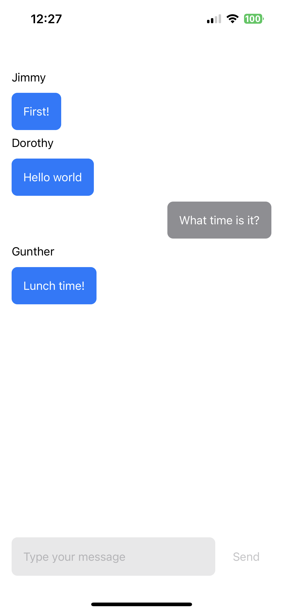

# SwiftUI RTM App

This is a simple chat application built using SwiftUI and Agora RTM (Real-Time Messaging) SDK. The app allows users to log in with a username, join a channel called "lobby", send and receive messages in real-time.

Created by Chat GPT.

| Login View | Chat View |
|:-:|:-:|
|  |  |

## Features

- Log in with a username
- Join a channel called "lobby"
- Send and receive real-time messages
- Messages appear on the left or right side of the screen depending on who sent them

## Requirements

- Xcode 12 or later
- Agora RTM SDK

## Getting Started

To get started with the app, follow these steps:

1. Clone the repository to your local machine.
2. Open the project in Xcode.
3. Agora RTM SDK will be automatically installed thanks to Swift Package Manager.
4. Go to [agora.io](https://agora.io), and sign up to get your App ID
5. Add the App ID and temporary token to the project where the placeholders are.
6. Run the app in Xcode by clicking the "Run" button.

## Usage

1. Enter a username in the login screen and tap "Log in".
2. Once logged in, you will automatically join the "lobby" channel.
3. All messages sent by other users will appear in the message list on the screen.
4. To send a message, type it in the text field at the bottom of the screen and tap "Send".

## Contributing

Contributions are welcome! If you find any issues or have ideas for new features, please open an issue or submit a pull request.

## License

This project is licensed under the MIT License - see the [LICENSE](LICENSE) file for details.
